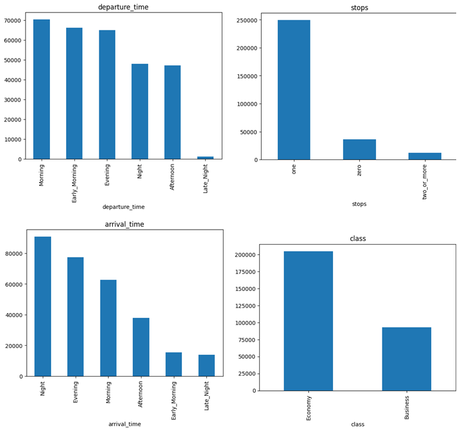

# Laporan Proyek Machine Learning - Muhammad Lailfachry Yusrie
## Domain Proyek
Domain yang dipilih untuk proyek *machine learning* ini adalah **Ekonomi dan Bisnis**, dengan judul **Predictive Analytics: Harga Tiket Pesawat**  

### Latar Belakang

Industri penerbangan global telah mengalami pertumbuhan yang signifikan, menjadikan perjalanan udara sebagai moda transportasi yang semakin mudah diakses dan penting bagi individu maupun bisnis. Di tengah dinamika pasar yang kompleks, harga tiket pesawat seringkali berfluktuasi secara drastis, dipengaruhi oleh berbagai faktor seperti waktu keberangkatan, rute, maskapai penerbangan, kelas penerbangan, musim, hingga dinamika penawaran dan permintaan. Volatilitas harga ini menjadi tantangan tersendiri bagi konsumen yang ingin merencanakan perjalanan dengan efisien dan hemat biaya. Tanpa informasi yang akurat mengenai estimasi harga yang wajar, penumpang berisiko membayar lebih mahal dari yang seharusnya atau kesulitan dalam mengalokasikan anggaran perjalanan secara optimal [[1](https://kumparan.com/jendela-dunia/kenapa-harga-tiket-pesawat-naik-turun-cari-tahu-jawabannya-di-sini-212Dwje2OR3)].
Pengembangkan model prediktif harga tiket pesawat ini diharapkan dapat memberikan estimasi harga yang akurat dan relevan bagi travel agent. Dengan memanfaatkan teknik machine learning berbasis regresi pada kumpulan data pemesanan tiket pesawat, model ini diharapkan mampu mengidentifikasi pola dan hubungan antara berbagai fitur perjalanan (maskapai, waktu keberangkatan, jumlah transit, durasi penerbangan, kota asal/tujuan, kelas, dan sisa hari sebelum keberangkatan) dengan harga tiket. Informasi prediksi harga ini akan memberdayakan konsumen untuk mengambil keputusan yang lebih cerdas. Penumpang dapat membandingkan harga yang ditawarkan oleh maskapai atau agen perjalanan dengan harga prediksi model, sehingga memungkinkan mereka untuk mengidentifikasi apakah harga yang ditawarkan lebih mahal atau lebih murah dari ekspektasi.

## Business Understanding
Pengembangan model prediksi harga tiket pesawat memiliki potensi untuk memberikan manfaat bagi berbagai pihak, termasuk calon penumpang, travel agent, dan maskapai penerbangan. Model ini dapat membantu mengestimasi harga tiket dari data yang ada, menjual tiket pesawat dengan harga yang optimal, dan meningkatkan kepercayaan penumpang. Contoh potensi manfaat hasil prediksi harga tiket pesawat yang akurat dapat membantu travel agent dan penumpang dalam menetapkan harga tiket yang tepat dan penumpang dapat merencanakan keuangan untuk perjalanannya dengan lebih tepat sasaran.

### Problem Statements
Berdasarkan latar belakang di atas, berikut ini merupakan rincian masalah yang dapat diselesaikan pada proyek ini:
-  Bagaimana membuat model machine learning yang dapat memprediksi harga tiket pesawat berdasarkan data harga tiket sebelumnya dan faktor yang mempengaruhi?
-  Model yang seperti apa yang memiliki akurasi paling baik?
-  Bagaimana model ini dapat membantu travel agent dan penumpang dalam mengestimasi harga tiket pesawat dengan tepat?
  
### Goals
Tujuan dari proyek ini adalah:
- Membuat model machine learning yang dapat memprediksi harga tiket pesawat berdasarkan data harga tiket sebelumnya.
- Membandingkan beberapa algoritma model untuk menemukan akurasi terbaik dalam memprediksi harga tiket.
- Mengembangkan aplikasi yang mudah digunakan untuk membantu penumpang mengestimasi harga tiket pesawat dan mengimplmentasikan model prediktif kedalam sistem yang digunakan travel agent.

### Solution Statements
-  Menganalisis data dengan melakukan univariate analysis dan multivariate analysis. Memahami data juga dapat dilakukan dengan visualisasi. Memahami data dapat membantu untuk mengetahui kolerasi matrix antar fitur dan mendeteksi outlier.
- Melakukan proses data cleaning dan normalisai data agar mendapat prediksi yang baik.
- Membuat beberapa variasi model untuk mendapatkan model yang paling baik dari beberapa model yang telah dibuat untuk prediksi harga tiket pesawat. Diantaranya adalah menggunakan:
    * Linear Regression adalah algoritma sederhana yang memodelkan hubungan antara satu atau lebih feature dan target variable dengan cara menemukan best-fit line yang meminimalkan selisih antara nilai yang diprediksi dan nilai aktual.[[2](https://www.nucleusbox.com/assumptions-of-linear-regression/)]
    * Random Forest adalah algoritma machine learning yang kuat yang dapat digunakan untuk berbagai tugas termasuk regresi dan klasifikasi. Ini adalah metode ensemble, yang berarti bahwa model random forest terdiri dari banyak decision tree kecil, yang disebut estimator, yang masing-masing menghasilkan prediksi mereka sendiri. Random forest menggabungkan prediksi estimator untuk menghasilkan prediksi yang lebih akurat .[[3](https://deepai.org/machine-learning-glossary-and-terms/random-forest)]
    * XGBoost (Extreme Gradient Boosting) adalah algoritma yang menggunakan pendekatan boosting, di mana model dibangun secara bertahap, dengan setiap model baru dilatih untuk memperbaiki kesalahan prediksi dari model sebelumnya.[[4](https://xgboost.readthedocs.io/en/stable/)]

## Data Understanding
### EDA - Deskripsi Variabel
**Informasi Datasets**

| Jenis | Keterangan |
| ------ | ------ |
| Title | _flight price prediction_ |
| Source | [Kaggle](https://www.kaggle.com/datasets/shubhambathwal/flight-price-prediction?select=Clean_Dataset.csv) |
| Maintainer | [Shubham Bathwal ⚡](https://www.kaggle.com/shubhambathwal) |
| License | Other (specified in description) |
| Visibility | Publik |
| Tags | _Computer Science, Business, Economics, Data Visualization, Regression, Exploratory Data Analysis_ |

Berikut informasi pada dataset: 
Data yang digunakan dalam pembuatan model merupakan data primer, data ini didapat dari sebuah perusahaan pertanian Amerika, yang disediakan secara publik di kaggle dengan nama datasets yaitu: _Apple Quality_

| airline | flight | source_city | departure_time | stops | arrival_time | destination_city | class | duration | days_left | price |
| ------ | ------ |------ | ------ | ------ | ------ |------ | ------ |------ | ------ | ------ |
| SpiceJet | SG-8709 | Delhi | Evening	| zero | Night | Mumbai | Economy | 2.17 | 1 | 5953 |
| SpiceJet | SG-8157 | Delhi | Early_Morning | zero | Morning | Mumbai | Economy | 2.33 | 1 | 5953 |
| AirAsia | I5-764 | Delhi | Early_Morning | zero | Early_Morning | Mumbai | Economy | 2.17 | 1 | 5956 |
| Vistara | UK-995 | Delhi | Morning | zero | Afternoon | Mumbai | Economy | 2.25 | 1 | 5955 |
| Vistara | UK-963 | Delhi | Morning | zero | Morning | Mumbai | Economy | 2.33 | 1 | 5955 |

Tabel 1. EDA Deskripsi Variabel

Dilihat dari _Tabel 1. EDA Deskripsi Variabel_ dataset ini tidak memiliki missing value didalamnya, tetapi terdapat outlier sehingga perlu ditangani. 
- Dataset berupa CSV (Comma-Seperated Values).
- Dataset memiliki 300152 sample dengan 11 fitur.
- Dataset memiliki 3 fitur bertipe muneric (1 int64 dan 2 float64) dan 8 fitur bertipe object.
- Terdapat 1 missing value dalam dataset.
### Variable - variable pada dataset
1) 'airline': Nama perusahaan penerbangan disimpan di kolom maskapai penerbangan. Ini adalah fitur kategoris yang memiliki 6 maskapai penerbangan yang berbeda.
2) 'flight': Penerbangan menyimpan informasi mengenai kode penerbangan pesawat. Ini adalah fitur kategoris.
3) 'source_city': Kota tempat penerbangan lepas landas. Ini adalah fitur kategoris yang memiliki 6 kota unik.
4) 'departure_time': Ini adalah fitur kategoris turunan yang diperoleh dengan mengelompokkan periode waktu ke dalam kelompok. Ini menyimpan informasi tentang waktu keberangkatan dan memiliki 6 label waktu yang unik.
5) 'stops': Fitur kategoris dengan 3 nilai berbeda yang menyimpan jumlah perhentian antara kota asal dan tujuan.
6) 'arrival_time': Ini adalah fitur kategoris turunan yang dibuat dengan mengelompokkan interval waktu ke dalam kotak. Fitur ini memiliki enam label waktu yang berbeda dan menyimpan informasi tentang waktu kedatangan.
7) 'destinationc_city': Kota tempat pesawat akan mendarat. Ini adalah fitur kategoris yang memiliki 6 kota unik.
8) 'class': Fitur kategoris yang berisi informasi tentang kelas kursi; fitur ini memiliki dua nilai yang berbeda: Bisnis dan Ekonomi.
9) 'duration': Fitur berkelanjutan yang menampilkan jumlah waktu keseluruhan yang diperlukan untuk bepergian antar kota dalam hitungan jam.
10) 'days_left': Ini adalah karakteristik turunan yang dihitung dengan mengurangi tanggal perjalanan dengan tanggal pemesanan.
11) 'price': Variabel target menyimpan informasi tentang harga tiket (dalam kurs India/Rupe).

Dari 11 fitur tersebut, yang akan dipakai hanya fitur 'departure_time', 'stops', arrival_time', 'class', 'duration', 'days_left', dan 'price' sebagai target. Fitur yang lain tidak dipakai karena datanya spesifik hanya berada di India. Oleh karena itu agar predictive model lebih relevan dan dapat digunakan oleh berbagai negara, maka data selain fitur diatas dihapus.

### EDA - Univariate Analysis

Gambar 1a. Analisis Univariat (Data Kategori) 

Gambar 1b. Analisis Univariat (Data Numerik) 

Berdasarkan _Gambar 1a_, Pagi dan Dini Hari adalah waktu keberangkatan puncak, menunjukkan preferensi di antara penumpang untuk memulai perjalanan mereka di pagi hari. Sebaliknya, Malam dan Sore hari adalah waktu kedatangan yang paling umum, menunjukkan bahwa penumpang lebih menyukai perjalanan di malam hari untuk mencapai tujuan mereka. Selain itu, Kelas ekonomi merupakan pilihan yang paling disukai oleh para pelancong, secara signifikan melampaui popularitas kelas bisnis dan mayoritas penumpang melakukan penerbangan hanya sekali tanpa perlu transit. Pada _Gambar 1b_, untuk data numerik memiliki karakteristik, yaitu distribusi kolom durasi menunjukkan kecenderungan yang signifikan. Visualisasi menunjukkan bahwa penerbangan dengan durasi antara 0-5 jam memiliki frekuensi tertinggi, menunjukkan bahwa rentang ini adalah yang paling umum dalam dataset.
Distribusi variabel harga juga menunjukkan tanda-tanda skewness.

### EDA - Multivariate Analysis

Gambar 2a. Analisis Biivariat (Kategorikal)

Gambar 2b. Analisis Bivariate (Numerikal)

Gambar 2c. Analisis Matriks Korelasi

Berdasarkan _Gambar 2a_ , dapat dilihat bahwa dari analisis multivariate untuk fitur kategori terhadap harga tiket didapatkan:

- Price by Class: Harga tiket kelas bisnis secara signifikan lebih tinggi dibandingkan kelas ekonomi. Harga tiket kelas ekonomi lebih terjangkau, sehingga menjadi pilihan yang populer bagi sebagian besar penumpang.
- Price by Total Stops: Penerbangan dengan jumlah stop >= 2 cenderung lebih mahal dibandingkan penerbangan non-stop. Temuan ini cukup menarik karena biasanya penerbangan nonstop akan cenderung lebih pricey. Hal ini mungkin dapat disebabkan karena mayoritas penerbangan nonstop adalah penerbangan jarak dekat yang memiliki harga tiket lebih rendah.
- Price by Departure dan Arrival Time: Harga tiket pesawat untuk penerbangan atau kedatangan tengah malam cenderung lebih murah dibandingkan waktu lainnya.

Berdasarkan _Gambar 2b_ , dapat dilihat bahwa Dari analisis multivariate untuk fitur numerikal terhadap harga tiket untuk kelas ekonomi dan bisnis didapatkan:
- Price by Duration: Kelas Bisnis memiliki kisaran harga yang jauh lebih tinggi dibandingkan dengan Kelas Ekonomi untuk hampir semua durasi penerbangan. Umumnya, harga untuk Kelas Ekonomi di bawah 400 USD, sedangkan Kelas Bisnis bisa mencapai harga di atas 1200 USD. Durasi penerbangan yang lebih lama tidak selalu berkorelasi langsung dengan harga yang lebih tinggi. Meskipun harga cenderung lebih tinggi untuk penerbangan yang lebih lama, terbukti bahwa harga tertinggi sedikit menurun untuk beberapa durasi yang sangat lama, terutama di Kelas Bisnis. Hal ini menunjukkan bahwa faktor selain durasi, seperti permintaan atau rute tertentu, juga dapat memengaruhi dinamika harga untuk penerbangan yang lebih lama.
- Price by Days Left: Tidak ada korelasi yang kuat antara harga tiket dan jumlah hari yang tersisa sebelum penerbangan, baik untuk Kelas Bisnis maupun Kelas Ekonomi. Oleh karena itu, tidak dapat diasumsikan bahwa membeli tiket lebih awal akan menghasilkan harga yang lebih murah. Namun, ada tren yang menunjukkan bahwa harga tiket cenderung naik sedikit ketika mendekati tanggal keberangkatan, meskipun harga tetap cukup bervariasi secara keseluruhan. Hal ini menunjukkan bahwa meskipun membeli tiket di menit-menit terakhir tidak selalu menghasilkan harga yang lebih tinggi secara signifikan, harga tiket dapat berfluktuasi berdasarkan permintaan dan ketersediaan.

Sehingga dapat dlihat pada _Gambar 2c_, merupakan Correlation Matrix menunjukkan hubungan antar fitur dalam nilai korelasi. Jika diamati, fitur duration memiliki skor korelasi yang cukup besar 0.22 dengan fitur target price. Sedangkan fitur days left berkolerasi negatif terhadap price.
  
## Data Preparation
Pada proses _Data Preparation_ dilakukan kegiatan seperti _Data Gathering_, _Data Assessing_, dan _Data Cleaning_. Pada proses Data Gathering, data diimpor sedemikian rupa agar bisa dibaca dengan baik menggunakan dataframe Pandas. Untuk proses Data Assessing, berikut adalah beberapa pengecekan yang dilakukan:
- Missing value (data atau informasi yang "hilang" atau tidak tersedia)
- Outlier (data yang menyimpang dari rata-rata sekumpulan data yang ada).

Pada proses _Data Cleaning_ yang dilakukan adalah seperti:
- Encoding dengan One Hot Encodier (Mengubah tipe katergorik menjadi numerik).
- Train Test Split (membagi data menjadi data latih dan data uji).
- Normalization (mentransformasi data ke dalam skala yang seragam sehingga semua fitur atau atribut memiliki rentang nilai yang sebanding).

Tabel 2. Melihat data missing value

Pada proyek kasus ini tidak ditemukannya _missing value_. Adapun untuk _outlier_ juga dilakukan dengan metode _dropping_ menggunakan metode IQR.  IQR dihitung dengan mengurangkan kuartil ketiga (Q3) dari kuartil pertama (Q1) sebagaimana rumus berikut.

$$IQR = Q_3 - Q_1$$

- Q1 adalah kuartil pertama 
- Q3 adalah kuartil ketiga.

Setelah menggunakan metode IQR untuk menghilangkan _outlier_ pada dataset jumlah dataset menjadi `297920` yang awalnya adalah `300153`.
Pada proyek ini digunakan _Train Test Split_ pada library  *sklearn.model_selection* untuk membagi dataset menjadi data latih dan data uji dengan pembagian sebesar 10:90 dan random state sebesar 123. Pada proyek kasus ini digunakan _Normalization_ pada library _sklearn.preprocessing.MinMaxScaler_ untuk menormalisasi dataset. Semua proses ini diperlukan dalam rangka membuat model yang baik.

## Modeling
Algoritma pada proyek ini melakukan pemodelan dengan 3 algoritma, yaitu:

 _Linear Regression_ adalah memodelkan hubungan antara satu atau lebih feature dan target variable dengan cara menemukan best-fit line yang meminimalkan selisih antara nilai yang diprediksi dan nilai aktual.

Keunggulan _Linear Regression_ :
- Cepat dan ringan — cocok untuk data kecil/menengah..
- Mudah diinterpretasi — koefisien menunjukkan pengaruh tiap fitur.
- Cocok untuk masalah linier sederhana.
- Tidak mudah overfitting jika asumsi terpenuhi.

Kerugian _Linear Regression_ :
- Asumsi linearitas antara fitur dan target harus terpenuhi. 
- Tidak bisa menangkap interaksi non-linear antar fitur. 
- Sensitif terhadap multikolinearitas (fitur saling berkorelasi).
- Performa rendah pada data kompleks.

 _Random Forest_ adalah algoritma machine learning ensemble yang menggabungkan beberapa decision tree untuk meningkatkan akurasi prediksi. Algoritma ini bekerja dengan membuat banyak decision tree secara acak dan kemudian menggunakan voting untuk memprediksi kategori atau nilai data baru. Adapun parameter yang digunakan pada proyek ini adalah:
- `max_depth` kedalaman maksimum.

Keunggulan _Random Forest_ :
- Memiliki akurasi prediksi yang tinggi.
- Mampu menangani dataset dengan dimensi tinggi.
- Tidak sensitif terhadap outlier.

Kerugian _Random Forest_ :
- Cenderung overfit pada dataset kecil. 
- Membutuhkan banyak waktu komputasi untuk pelatihan. 
- Sulit untuk diinterpretasikan.

 _XGBoost (Extreme Gradient Boosting)_ adalah algoritma pembelajaran mesin yang dirancang untuk meningkatkan akurasi dan efisiensi prediksi, terutama dalam konteks regresi dan klasifikasi. Algoritma ini menggunakan pendekatan boosting, di mana model dibangun secara bertahap, dengan setiap model baru dilatih untuk memperbaiki kesalahan prediksi dari model sebelumnya. XGBoost mengoptimalkan fungsi kehilangan dengan menggunakan teknik regularisasi dan pembelajaran paralel untuk meningkatkan performa dan kecepatan.
 
 Keuntungan  _XGBoost (Extreme Gradient Boosting)_ :
- Sangat presisi tinggi — sering menang di kompetisi seperti Kaggle.
- Mendukung regularisasi → mengurangi overfitting
- Cepat dan efisien (dibanding model boosting lainnya).
- Sangat baik untuk data besar & kompleks.

Kerugian  _XGBoost (Extreme Gradient Boosting)_ :
- Lebih kompleks — banyak hyperparameter perlu disetel.
- Training time lebih lama dari Random Forest (terutama untuk tuning).
- Bisa overfitting jika tidak dituning dengan baik.

## Evaluation

Dalam tahap evaluasi, metrik yang digunakan adalah `R2 Score`
R² Score adalah sebuah metrik yang digunakan untuk mengevaluasi seberapa baik model regresi dapat menjelaskan variasi dari data target (nilai aktual). Nilai R² menunjukkan persentase variasi data yang berhasil dijelaskan oleh model. Rumus:

\[
R^2 = 1 - \frac{\sum_{i=1}^{n}(y_i - \hat{y}_i)^2}{\sum_{i=1}^{n}(y_i - \bar{y})^2}
\]

Keterangan:
- \( y_i \): Nilai aktual
- \( \hat{y}_i \): Nilai prediksi
- \( \bar{y} \): Rata-rata dari nilai aktual
- \( n \): Jumlah data.

Berikut hasil \[R^2\] dari 3 buah model yang latih:

| Model | r2-score |
| ------ | ------ |
| Linear Regression | 0.904056 |
| RandomForest  | 0.971407 |
| XGBoost | 0.953829 |

Tabel 3. Hasil R2 Score

Dilihat dari _Tabel 3. Hasil R2 Score_, dapat diketahui bahwa model dengan algoritma _Random Forest_ memiliki R2 Score yang lebih tinggi sebesar `97.14%` . Untuk itu model tersebut yang akan dipilih untuk digunakan. Diharapkan dengan model yang telah dikembangan dapat memprediksi harga tiket pesawat dengan baik menggunakan _Random Forest_.

## Referensi
[1]. [https://kumparan.com/jendela-dunia/kenapa-harga-tiket-pesawat-naik-turun-cari-tahu-jawabannya-di-sini-212Dwje2OR3](https://kumparan.com/jendela-dunia/kenapa-harga-tiket-pesawat-naik-turun-cari-tahu-jawabannya-di-sini-212Dwje2OR3).
[2]. [https://www.nucleusbox.com/assumptions-of-linear-regression/](https://www.nucleusbox.com/assumptions-of-linear-regression/)
[3]. [https://deepai.org/machine-learning-glossary-and-terms/random-forest](https://deepai.org/machine-learning-glossary-and-terms/random-forest).
[4]. [https://xgboost.readthedocs.io/en/stable/](https://xgboost.readthedocs.io/en/stable/)
_
